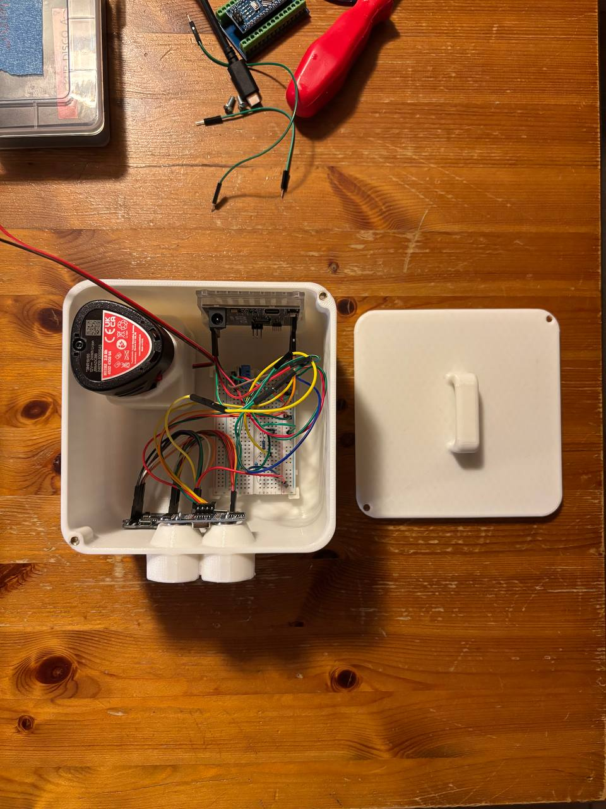
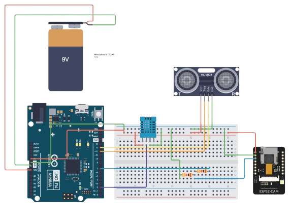
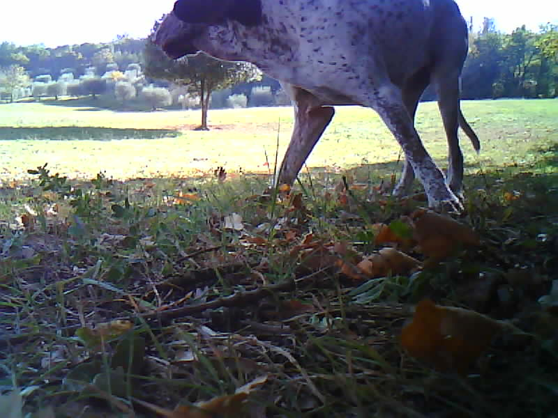
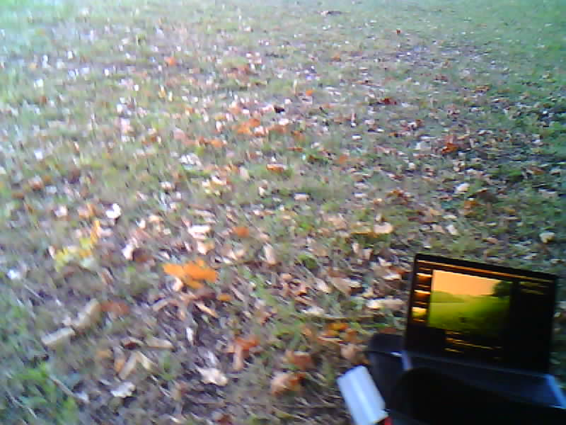
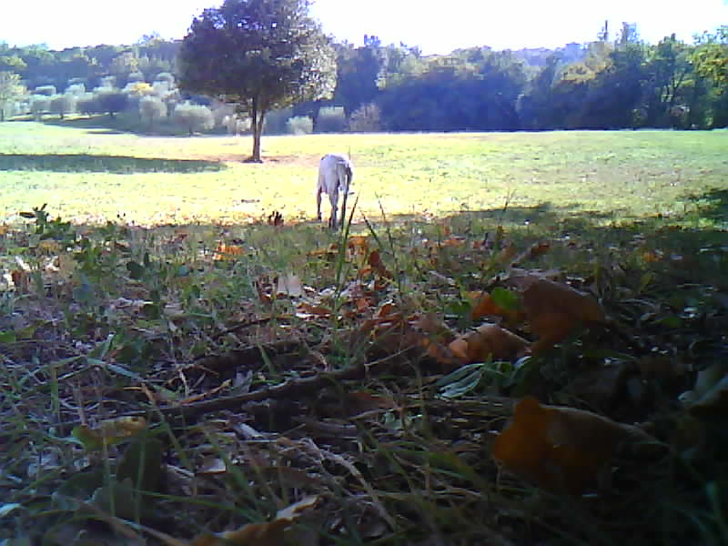
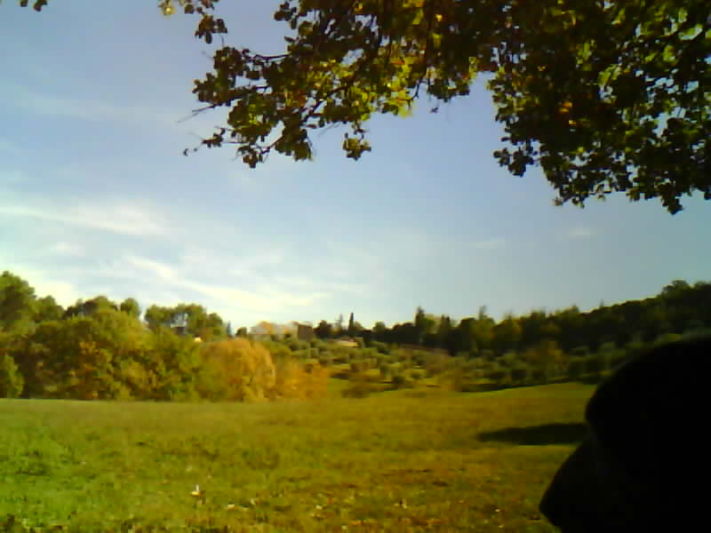
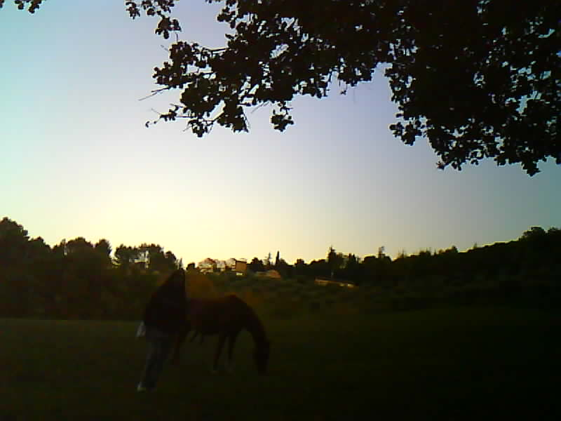

# cam-ino

## Components:

- [Arduino Uno R4 Minima](https://store.arduino.cc/products/uno-r4-minima?utm_source=google&utm_medium=cpc&utm_campaign=EU-Pmax&gad_source=1&gad_campaignid=22591753150&gclid=Cj0KCQjw58PGBhCkARIsADbDilx_TAh3w0jdO3l3JqwxRJk4iB5ktNN-RDxPpkH0SYOuEU9TuWpYbtIaAiF1EALw_wcB)
- [ESP32-CAM](https://www.amazon.it/-/en/dp/B093GSCBWJ?ref=ppx_yo2ov_dt_b_fed_asin_title)
  - [OV2640](https://www.amazon.it/-/en/OV2640-Camera-Megapixel-Support-T-Camera/dp/B0BXSL76L8/ref=sr_1_7?dib=eyJ2IjoiMSJ9.qHo00YHP3aaP5UdydLFZ3rSEdK0mDMOzicrb1zak2A1sKR-OCnEZQ4MrG_nmo8PQllK4wgRuaht3xM_4fAeG9_e4MXPT5h_8Qyr9sTQAL0YDp8CG2EOYEALkXVbFdKN9cUlBR8RvH6Wboe4EptuIB2z-wTVArroGmN2TkbO_AmUuDr8dPbGdeReylzUdXfJLqApM9tb69wLkMX2FNoJHOwLMXYWesd2_6vDX2teVul3EkaJFxAnq2r8JXQIeh2OhmuKGGC05nGrMj_LACeD28PZXUVQRKjSmnIDylZfDtbc.tnwaWs29im2LnQGBAyyCNgK334bsq8v0ENxwNqygAuU&dib_tag=se&keywords=ov2640&qid=1758558941&sr=8-7)
  - [SanDisk Ultra 32GB microSDHC](https://www.amazon.it/-/en/dp/B08GY9NYRM?ref=ppx_yo2ov_dt_b_fed_asin_title&th=1)
- [DHT sensor](https://www.amazon.it/-/en/dp/B0CK195FRJ?ref=ppx_yo2ov_dt_b_fed_asin_title)
- [HC-SR04 Ultrasonic Sensor](https://www.amazon.it/ELEGOO-HC-SR04-Ultrasonic-Distance-Sensor/dp/B01COSN7O6/ref=sr_1_2?crid=YYKUKT3DK29D&dib=eyJ2IjoiMSJ9.uHYik-fiQDBNhwQz-q2d4VYyIBahinERcRU2S7XWuS9PGxL5ws191wDtMm8E9Xc3A6t_XD3YviwvZJZ3pSo386YS4K6668ZzphHH9dCvhywfHS6mgdJkClRB7MyYteUb-KYoacXOLhsHGwPgOtVPrWRdU1vOfWW6oNshRn22noKonKJQM1jIQkGRG53Iw9Bol1lYQkN6trzILwRdtR_27PP1L7uI8hiOVxhlwSOG1AtQU1jwqPGhew9_tafTUxWyxxU95WIsQi6JO65p2KvQjnNKQOtTbu-emOyGFo-EA20.8gLoBgAfhiVJ-GIfS2EFbVrK-ZH3GporWQ9AgyhkH2E&dib_tag=se&keywords=HS-C+ultrasonic+sensor&qid=1758557098&sprefix=hs-c+ultrasonic+sensor%2Caps%2C79&sr=8-2)

## How It Works

### Object Detection

Arduino Uno manages the HC-SR04 ultrasonic sensor and the DHT sensor. The HC-SR04 sensor works by sending sound waves from the transmitter, which then bounce off of an object and then return to the receiver. One can determine how far away something is by measuring time it takes for the sound waves to get back to the sensor. The speed of sound in the air is approximately 331 m/s at 20˚C (0,331 cm/$\mu\text{s}$) so in order to calculate the distance of an object one can use

$$ d = \frac{(v \times duration)}{2} $$

where $v$ is the speed of sound in cm/$\mu\text{s}$ and $duration$ is the duration of the sonic burst in $\mu\text{s}$. All divided by two because it's a round trip. To better approximate the real distance of an object Arduino Uno manages a DHT sensor that can measure ambient humidity and temperature. While the humidity is not quite negligible for the speed of sound calculation, the temperature is quite relevant. One can adjust the speed of sound calculation (in m/s) in the air parametrizing it with temperature and humidity:

$$ v = 331.4 + (0.6 _ t) + (0.0124 _ h) $$

where $t$ and $v$ are temperature and humidity respectively.

### Trigger Photo Shoot

When an object is quite near (~100cm) Arduino Uno sends a 5v signal to ESP32-CAM using one of its digital pin. Since the ESP32-CAM works with 3.3v the two are connected using a [voltage divider](https://en.wikipedia.org/wiki/Voltage_divider) circuit that lowers the input for the ESP32-CAM at 3.3v. Once the ESP32-CAM receives the trigger signal it starts the capturing process. The photo is taken using a [OV2640](https://blog.arducam.com/ov2640/) camera that shoots at SVGA (800x600) resolution. ESP32-CAM generates random names for the pictures and stores them on a SanDisk Ultra 32GB microSDHC.

## Wirings

## 3D Model Case

### v1

The components are "organized" inside a cool 3D printed box with its own cover. The two `.stl` filese are available in this repository and can be 3D printed in a couple of hours.

- [3d-case/hunter-case.stl](3d-case/hunter-case.stl)
- [3d-case/hunter-case-cover.stl](3d-case/hunter-case-cover.stl)

The two holes at the top are for the HC-SR04 sensor, while the hole at the bottom is for the camera. Originally the camera was meant to be a [OV7670](https://futuranet.it/prodotto/ov7670-modulo-telecamera-digitale-per-arduino/?utm_source=Google+Shopping&utm_medium=cpc&utm_campaign=futuranet_gs&gad_source=1&gad_campaignid=17338545980&gclid=CjwKCAjwisnGBhAXEiwA0zEORypyMFtdpkvOQo0-dmvAMKoPEPmqwl3E5K_EAcJn--W6_fJySwDAihoCzq8QAvD_BwE) or a [TTL Serial JPEG Camera](https://www.adafruit.com/product/397) but for many reasons that was not the _case_.

### v2

A second version of the case that fits the ESP32CAM is available at [3d-case/hunter-case.stl](3d-case/hunter-case-v2.stl). It's compatible with the v1's cover.

## Energy Consumption

| **Component**                                                                                | **Typ (mA)** | **Max (mA)** |
| -------------------------------------------------------------------------------------------- | ------------ | ------------ |
| [Arduino Uno R4 Minima](https://docs.arduino.cc/resources/datasheets/ABX00080-datasheet.pdf) | 33.30        | 36.98        |
| [ESP32-CAM](https://www.handsontec.com/dataspecs/module/ESP32-CAM.pdf)                       | 180          | 310          |
| [HC-SR04](https://cdn.sparkfun.com/datasheets/Sensors/Proximity/HCSR04.pdf)                  | 15           | 15           |
| [DHT21](https://mikroshop.ch/pdf/DHT21.pdf)                                                  | 1.5          | 2.1          |

Considering max current draw for each component (except for the ESP32CAM where average is considerd) the total power consumption is:

$$ 36,98 \ \text{mA} + 180 \ \text{mA} + 15 \ \text{mA} + 2,1 \ \text{mA} \approx 234 \ \text{mA} $$

With a power supply of $5\text{V}$ the $\text{Wh}$ usage is:

$$ 5\text{V} \times 0,234 \ \text{A} \times 1 \text{h} = 1,17 \ \text{Wh} $$

Considering a power supply of 2 Ah @5V (10 Wh) cam-ino should last

$$ \frac{10 \ \text{Wh}}{1,17 \ \text{Wh}} \approx 8\text{h} \ 30\text{m} $$

### How I Power It

I use a [Milwaukee M12 2.0Ah](https://www.hbushop.it/it/307--batteria-20ah-.html?cmp_id=21384869713&adg_id=&kwd=&device=c&gad_source=1&gad_campaignid=21374500512&gclid=Cj0KCQjwgKjHBhChARIsAPJR3xdxZlNA78KBWO5i21A_b1dezyT1E-73Q4lDh3nvZW2EYoKrW0qLmPgaAraOEALw_wcB) battery @12V. I supply power to the Arduino Uno R4 Minima's VIN pin and distribute voltage using 5V pin. With this battery cam-ino should last $\approx 20\text{h} \ 30\text{m}$.

## Shots

